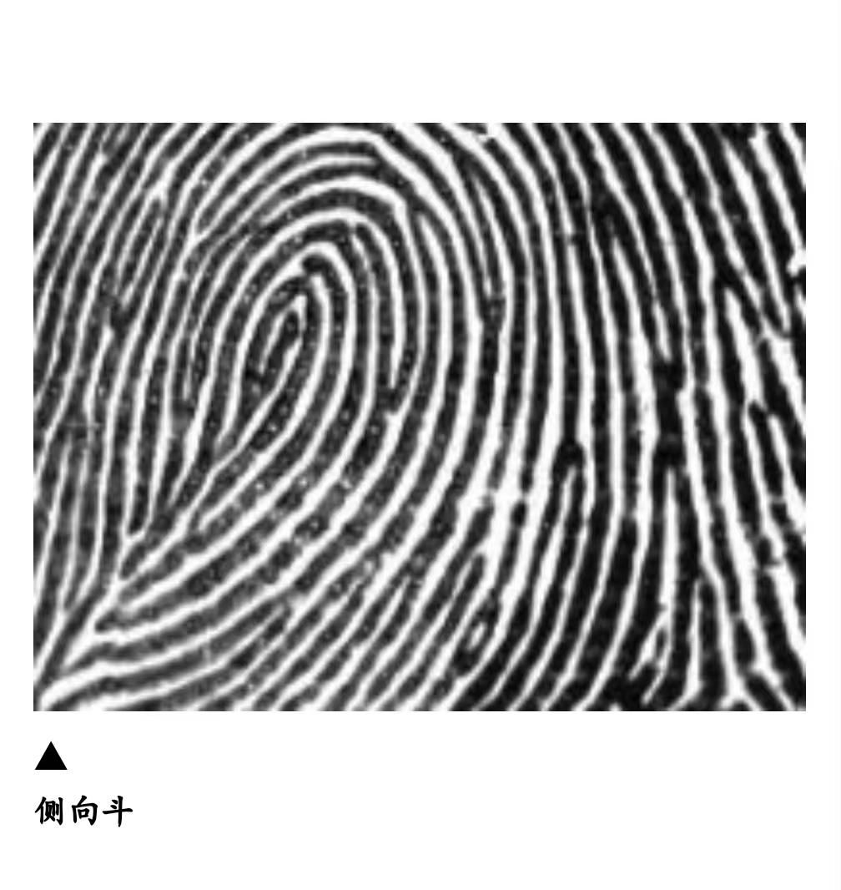
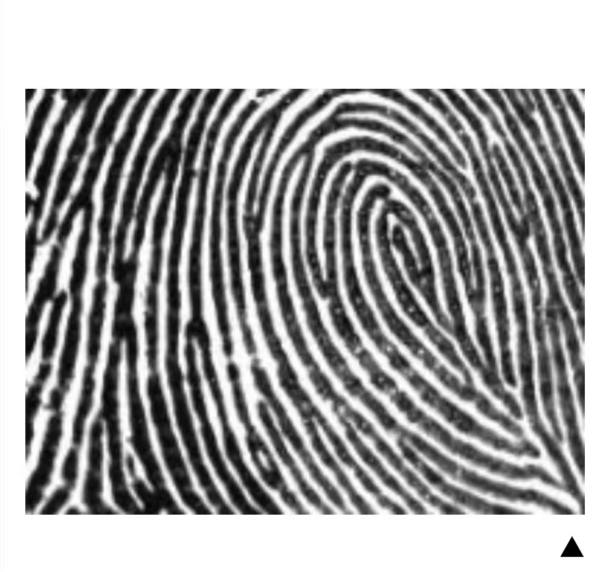

# AIPIWEN · fingerprint-v2-wizard.html — 自我审阅报告 V1

> 审阅范围：`fingerprint-v2-wizard.html`（全文 2109 行）
> 审阅方式：逐行代码阅读 + 逻辑推演
> 日期：2026-06-14
> 优先级：P0 = 必修 / P1 = 本周 / P2 = 下个迭代 / P3 = 长期优化

---

## 一、已确认 Bug（可直接修复）

### BUG-01 · P1 · `Wsp-r` 图片路径写错了

**位置**：第 1138 行、第 1193 行（S6 右拇指 + 左拇指的 `Wsp-r` 选项）

**问题**：`patterns/Wsp-r.jpg` 这个文件**实际上存在**，但代码两处都写成了 `patterns/Wsp.jpg`：

```html
<!-- 当前（错误） -->
  <!-- Wsp-r 的卡片，但用了 Wsp 的图 -->

<!-- 应改为 -->

```

**影响**：用户无法通过图片区分 `侧向斗` 和 `反侧向斗`，选错概率高。

---

### BUG-02 · P1 · 十斗快速通道 S6 按钮文字有误导

**位置**：第 1199 行、`s6Next()` 函数（第 1685 行）

**问题**：用户通过"十斗快速通道"进入 S6 时，按钮仍显示：

> `确认，看其他手指的斗`

但点击后代码执行 `showResult()`，**直接出结果，不进 S7**。用户看到"看其他手指的斗"会误以为还有操作，产生困惑。

**修复**：S6 初始化时，按快速通道来源动态更新按钮文字：

```javascript
// 在 s6UpdateBtn() 或 s6Init() 中加：
document.getElementById('s6-btn').textContent =
  state.allTenWhorls ? '确认，查看我的天赋报告' : '确认，看其他手指的斗';
```

---

### BUG-03 · P2 · `generateReport()` 存在从未触发的死代码

**位置**：第 1860 行、第 1872 行

```javascript
} else if (key === 'w' || key === 'w_mild') {   // w_mild 永远不出现
} else if (key === 'l' || key === 'l_mild') {   // l_mild 永远不出现
```

`classify()` 从未返回 `w_mild` 或 `l_mild`，是老版本遗留。不影响运行，但增加维护混乱。直接删掉 `|| key === 'w_mild'` 和 `|| key === 'l_mild'` 即可。

---

### BUG-04 · P1 · `generatePoster()` 缺少防抖保护

**位置**：第 1274 行（按钮）、第 1994 行（函数）

**问题**：用户快速多次点击"生成分享海报"，会触发多次 `html2canvas()`。每次都要几百毫秒，多次调用会导致 modal 里图片闪烁、内存占用飙升。

**修复**：生成期间 disable 按钮：

```javascript
async function generatePoster() {
  const btn = document.querySelector('.btn-share');
  if (btn) { btn.disabled = true; btn.textContent = '生成中…'; }
  try {
    // ... 现有逻辑
  } finally {
    if (btn) { btn.disabled = false; btn.textContent = '生成分享海报'; }
  }
}
```

---

### BUG-05 · P2 · `combo_open` 类型海报天赋标签只有 3 项

**位置**：第 1909 行

```javascript
talents = '主导天赋 + 海绵吸收力 · 踏实肯干 · 主见与执行兼备';
```

用 `·` 分隔后只有 3 项。海报天赋区是 2×2 grid，`slice(0,4)` 只能取到 3 个，右下角留空格，视觉上不平衡。

**修复**：改为 4 项：
```javascript
talents = '主导天赋 · 海绵吸收力 · 踏实肯干 · 主见执行兼备';
```

---

## 二、分类逻辑问题

### LOGIC-01 · P1 · `combo_w` 覆盖三种不同组合，文案完全一样

`combo_w` key 实际上对应：
- 认知兼整合（rt=Ws, lt=Wc）
- 认知兼完美（rt=Ws, lt=Wpe）
- 整合兼完美（rt=Wc, lt=Wpe）

当前 PCFG 的 hook 是通用的"两种天赋同时存在"，对三种组合一视同仁。转化效果弱。

**建议方案**：在 classify() 中拆分 key：
```javascript
// 在 Rule5 combo 分支中：
if (a === '认知' && b === '整合') comboKey = 'combo_w_ci';
if (a === '认知' && b === '完美') comboKey = 'combo_w_cp';
if (a === '整合' && b === '完美') comboKey = 'combo_w_ip';
```
并在 PCFG 和 generateReport 中分别配置专属文案。这是一个**内容质量升级**，不是紧急 bug，但对高概率出现的这个类型有明显的转化收益。

---

### LOGIC-02 · P2 · Rule 3 食指弧逻辑有隐性冗余路径

**代码位置**：第 1795-1801 行

```javascript
if (hasIndexArc) {
  const lbl = ltLbl !== '开放' ? ltLbl : rtLbl;
  if (lbl !== '开放')
    return { key: 'combo_open' };
  // 如果 lbl === '开放'：静默落穿到 Rule 4 / Rule 5
}
```

**问题**：如果双拇指都是弧（两者都是"开放"标签），`lbl = '开放'`，`if (lbl !== '开放')` 不满足，直接落穿。Rule 5 最终返回 `开放型 x`，结果正确，但代码路径不清晰，维护时容易误读为"食指弧一定会输出 combo_open"。

**建议**：加注释明确此路径：
```javascript
// 注：若双拇指均为弧形纹（开放），此分支不触发，
// 落到 Rule 5 由拇指判定输出 开放型 x。
```

---

### LOGIC-03 · P3 · `开放型（x）` 来自两条不同规则，但无法区分

Rule 3 (`totalArc ≥ 6`) 和 Rule 5 (双拇指均为弧形纹) 都输出 `key: 'x'`。这两种情况皮纹学含义不同：
- Rule 3：绝大多数手指是弧形，极端开放型
- Rule 5：仅拇指是弧，其他手指不确定

当前对外展示完全一样。若未来报告需要区分，应拆为 `x_strong` vs `x_base`。当前阶段不影响产品，记录备用。

---

## 三、UX 体验问题

### UX-01 · P1 · 快速通道用户进度条显示7步但实际走4步

**问题**：十斗快速通道路径 = S1 → S2 → S6 → Result，共4屏。但进度条始终显示"共7步"，S6 显示"第6步"，用户以为还有两步。

**建议**：快速通道激活后，在 `s2AllWhorls()` 中调整进度条显示：
```javascript
function s2AllWhorls() {
  // ...现有代码...
  // 更新进度提示
  document.getElementById('stepLabel').textContent = '快速通道 · 第 2 步 / 共 3 步';
}
```
或更简单：不更新总步数，但在 S6 标题下加一行提示："✓ 已确认十指全斗，最后一步确认拇指类型"。

---

### UX-02 · P2 · S7 "没有斗"按钮文字过长，视觉权重不对

**位置**：第 1245 行

```html
<button class="btn-secondary" onclick="s7None()">
  其他手指都不是斗，直接看结果
</button>
```

18个字，比"查看我的天赋报告"长50%，但视觉样式是次要按钮。建议改为：

```html
<button class="btn-secondary" onclick="s7None()">跳过，没有其他斗形纹</button>
```

---

### UX-03 · P2 · Result Screen 缺少完成状态的情绪强化

**当前**：滚动到结果屏后直接看到类型名 + 报告，没有任何进入动效或"恭喜"情绪强化。

**建议**：result-reveal 区域加入简单的 CSS 淡入：
```css
@keyframes revealFade {
  from { opacity: 0; transform: translateY(16px); }
  to   { opacity: 1; transform: translateY(0); }
}
.result-reveal { animation: revealFade .5s ease both; }
```
成本极低，情绪价值高（用户花了7步终于看到结果，值得一点仪式感）。

---

### UX-04 · P3 · 海报生成后用户不知道怎么操作

**当前**：海报图片下方有一行灰色文字 `长按图片保存，分享给朋友`（line 1346），但在暗色背景上对比度低，且位于图片**下方**容易被忽略。

**建议**：把提示移到图片**上方**，改为更醒目的提示：
```html
<div style="font-size:13px;color:rgba(253,252,248,.55);text-align:center;
            margin-bottom:10px;letter-spacing:.04em;">
  ↓ 长按图片保存到相册
</div>
```

---

## 四、可优化项

### OPT-01 · P1 · QR 码 URL 没有 UTM 追踪参数

**当前**：
```javascript
new QRCode(tmp, { text: 'https://aipiwen.cn', ... });
```

**问题**：所有类型的海报都指向同一个 URL，无法统计哪种类型海报带来了实际流量。

**建议**：
```javascript
const trackUrl = `https://aipiwen.cn?utm_source=poster&utm_medium=share&type=${result.key}`;
new QRCode(tmp, { text: trackUrl, ... });
```
成本：1行修改。收益：清楚看到哪种类型海报转化率最高，为 PCFG 文案优化提供数据依据。

---

### OPT-02 · P2 · patterns/*.jpg 没有预加载，可能出现图片白块

**问题**：12张指纹图片全靠懒加载，用户在每个步骤第一次看到时可能出现短暂白块（尤其是网络较差时）。

**建议**：在 `<head>` 加预加载：
```html
<link rel="preload" href="patterns/X.jpg"   as="image">
<link rel="preload" href="patterns/Xn.jpg"  as="image">
<link rel="preload" href="patterns/Lu.jpg"  as="image">
<link rel="preload" href="patterns/Ws.jpg"  as="image">
<!-- 最常见的4种纹型优先，其余按需 -->
```

---

### OPT-03 · P2 · 超级认知系列与普通系列的视觉区分度不够

**当前**：超级认知用 `#D4891A`，普通类型用 `#C2692A`。两者都是琥珀色，在海报上几乎看不出差异。

**建议**：在 `_fpSVG()` 中对超级认知系列额外增加中心光晕亮度：
```javascript
// 在 generatePoster() 中调用 _fpSVG 时传入 isSuper 标志
const isSuper = ['super_w_a','super_w_b','super_w_c'].includes(result.key);
document.getElementById('pFpWrap').innerHTML = _fpSVG(cfg.color, isSuper);
```
然后在 `_fpSVG(color, isSuper=false)` 中：
```javascript
// 中心圆点不透明度：super → 1.0，普通 → 1.0（已经是1了）
// 中心光晕 opacity：super → 0.28，普通 → 0.18
const coreOp = isSuper ? 0.28 : 0.18;
```
微调，成本低，让"超级"在视觉上真的有超级感。

---

### OPT-04 · P2 · Result Screen 缺乏数据采集钩子

**当前**：用户完成测评到达 Result Screen，没有任何事件记录。不知道有多少人真正看到了结果页（vs 中途放弃）。

**建议**：在 `showResult()` 中加一行统计：
```javascript
// 简单版：发一个 Beacon 到 Vercel 函数
navigator.sendBeacon('/api/track', JSON.stringify({
  event: 'result_view', key: result.key, ts: Date.now()
}));
```
或更轻量：用已有的 `localStorage` 写一条记录：
```javascript
const history = JSON.parse(localStorage.getItem('aipiwen_history') || '[]');
history.push({ key: result.key, ts: Date.now() });
localStorage.setItem('aipiwen_history', JSON.stringify(history.slice(-10)));
```
admin.html 读取这些数据时就能看到用户完成率和类型分布。

---

### OPT-05 · P3 · QR 码 CDN 失败时无友好提示

**当前**：如果 `qrcodejs` CDN（jsdelivr）加载失败，`new QRCode(...)` 抛出 `ReferenceError: QRCode is not defined`，被 `generatePoster()` 的 catch 捕获，显示通用错误"海报生成失败"，用户不知道是 QR 问题。

**建议**：在 QR 生成前加检查：
```javascript
if (typeof QRCode === 'undefined') {
  // QR 码库未加载，降级处理：不显示 QR，或内联一个备用 QR
  document.getElementById('posterQR').style.display = 'none';
} else {
  // 正常生成
}
```

---

### OPT-06 · P3 · 单文件 2109 行，三个关注点混在一起

当前文件包含：
- 向导 UI（HTML + CSS）
- 状态机逻辑（classify、step functions）
- 报告内容（generateReport — 约 200 行文案）
- 海报生成系统（generatePoster、_fpSVG、PCFG）

**未来可拆分方向**（不建议现在做）：
```
fingerprint-v2-wizard.html   ← 仅 UI + 状态机
js/fp-classify.js            ← classify() + PCFG
js/fp-report.js              ← generateReport()
js/fp-poster.js              ← generatePoster() + _fpSVG()
```
当前阶段维护成本尚可，此项等产品稳定后再考虑。

---

## 五、综合优先级排序

| 编号 | 问题 | 优先级 | 修改成本 | 收益 |
|------|------|--------|---------|------|
| BUG-01 | Wsp-r 图片路径错误 | P1 | 2行 | 用户识别准确性 |
| BUG-02 | 快速通道S6按钮文字误导 | P1 | 5行 | UX清晰度 |
| BUG-04 | 海报生成无防抖 | P1 | 8行 | 稳定性 |
| OPT-01 | QR码无UTM追踪 | P1 | 1行 | 数据洞察 |
| BUG-05 | combo_open标签只有3项 | P1 | 1行 | 海报美观 |
| BUG-03 | 死代码清除 | P2 | 2行 | 代码整洁 |
| UX-01 | 快速通道进度条 | P2 | 5行 | 体验 |
| UX-02 | S7按钮文字 | P2 | 1行 | 体验 |
| UX-03 | Result淡入动效 | P2 | 5行CSS | 情绪价值 |
| UX-04 | 海报操作提示位置 | P2 | 3行 | 完成率 |
| LOGIC-01 | combo_w三种组合拆分 | P2 | 20行 | 转化率 |
| OPT-04 | Result数据采集 | P2 | 5行 | 运营数据 |
| OPT-03 | 超级认知SVG差异化 | P2 | 3行 | 品牌感 |
| OPT-02 | 图片预加载 | P2 | 4行HTML | 流畅度 |
| OPT-05 | QR库失败降级 | P3 | 10行 | 容错 |
| LOGIC-02 | Rule3注释 | P3 | 1行注释 | 维护性 |
| LOGIC-03 | 开放型key拆分 | P3 | 20行 | 未来扩展 |
| OPT-06 | 文件拆分 | 不急 | 大 | 架构 |

---

## 六、本次审阅结论

**整体质量评估**：逻辑完整，分类引擎 5 条规则实现正确无主线漏洞，海报生成链路完整，UX 整体流畅。

**最应立即修复**：BUG-01（Wsp-r 图片）+ BUG-02（按钮文字）+ OPT-01（UTM）。三个都是1-5行修改，高收益低成本。

**最有转化价值的优化**：LOGIC-01（combo_w 三类型拆分专属文案）。combo_w 是第二高概率出现的类型（两拇指不同斗形纹），当前通用文案是转化漏洞。

**最容易被忽视的问题**：BUG-05（combo_open海报标签3项）。视觉上只有轻微瑕疵，但这个类型真实存在、会被用户测到。

---

*本报告基于 2026-06-14 当前代码（commit 0a649af）的逐行静态审阅。不包含运行时测试结果。*
